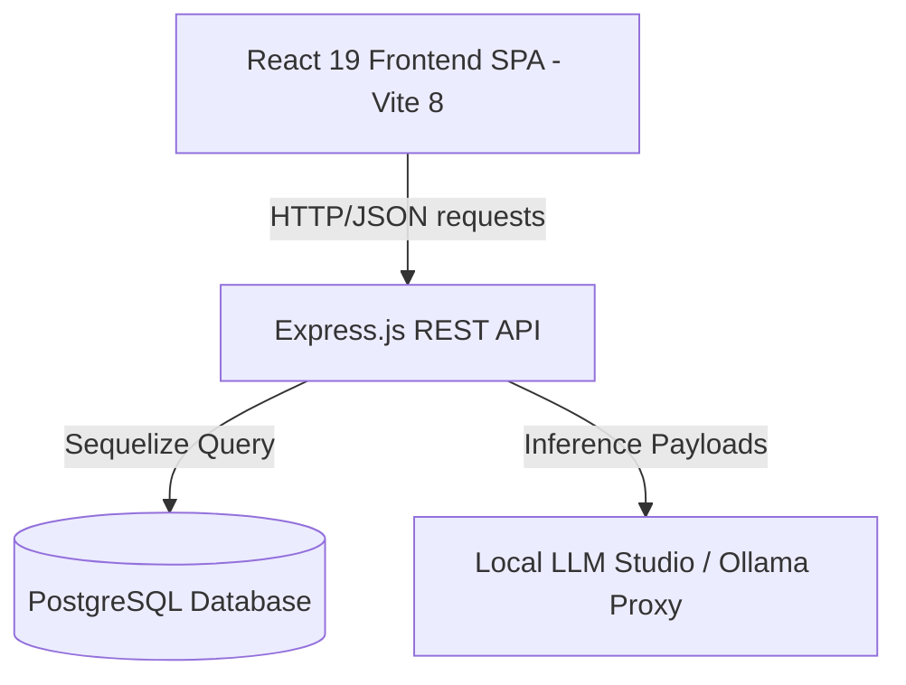
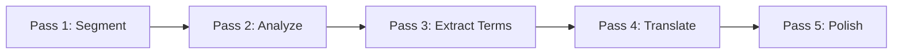
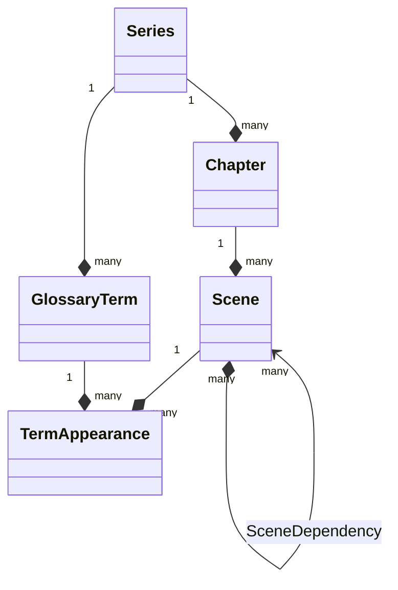

# 📖 Novel Translator V5 (Master Documentation)

A sophisticated, premium, AI-powered literary translation processor for Japanese/Chinese novels with an integrated, context-aware glossary system and a unified, 5-pass scene pipeline.

---

## 🎯 Table of Contents
1. [🚀 Quick Start](#-1-quick-start)
2. [🏗️ Architecture & Technology Stack](#%EF%B8%8F-2-architecture--technology-stack)
3. [🗺️ File Directory Structure](#%EF%B8%8F-3-file-directory-structure)
4. [⛓️ The 5-Pass Pipeline Workflow](#%E2%9A%9E%EF%B8%8F-4-the-5-pass-pipeline-workflow)
5. [🗄️ Database Schema & Model Relationships](#%F5%97%A4%EF%B8%8F-5-database-schema--model-relationships)
6. [🔌 API Reference](#-6-api-reference)
7. [⚡ Inference & Local LLM Optimization (Hook Compression)](#%E2%9A%A1-7-inference--local-llm-optimization-hook-compression)
8. [🛠️ Verification & Testing](#%EF%B8%8F-8-verification--testing)
9. [⚠️ Troubleshooting & FAQ](#%EF%B8%8F-9-troubleshooting--faq)

---

## 🚀 1. Quick Start

### Prerequisites
* **Node.js**: v22+ (recommending Zero-Dependency hot reloading with `--watch` mode).
* **npm**: v10+.
* **PostgreSQL**: v12+ (configured with database named `novelTranslatorV5` or customizable in configuration).

### One-Command Startup (TL;DR)
To get the entire stack (React Frontend + Express Backend) running locally:

```bash
# 1. Start PostgreSQL and create the database
psql -U postgres -c "CREATE DATABASE novelTranslatorV5;"

# 2. Run from the project root workspace
npm install
npm run dev
```

Open your browser to: **`http://localhost:5173`**

---

## 🏗️ 2. Architecture & Technology Stack

The application is built on a clean, modern decoupled client-server architecture with a heavy focus on rapid local inference and transactional database integrity.

### Frontend SPA (Vite + React)
* **Framework**: React 19, TypeScript
* **Styling**: Tailwind CSS v4, Lucide React, and Radix UI components (Glossary approval modals, conflict resolution interfaces).
* **Build System**: Vite 8 (~300ms prefill pre-bundle speeds).

### Backend REST API (Express + Sequelize)
* **Framework**: Express.js
* **ORM**: Sequelize 6 + `pg` client
* **Inference Integration**: Configurable LLM models with complete fallback-free error propagation.
* **Node Environment**: Running native `node --watch app.js` (hot-reloading active out of the box in Node.js v22).

### System Topology


---

## 🗺️ 3. File Directory Structure

Here is the clean, consolidated directory layout of the application:

```
├── backend/                  # Express + Sequelize API
│   ├── config/               # Database credentials & configurations
│   ├── controllers/          # Route handlers (series, chapters, scenes, glossaries)
│   ├── models/               # Sequelize database models (Series, Chapter, Scene, etc.)
│   ├── routes/               # API endpoints (/api/series, /api/chapters, etc.)
│   ├── services/             # Core business logic (scene segmentation, term extraction)
│   └── app.js                # API Entry Point (native Node v22 watch mode active)
│
├── frontend/                 # React + TypeScript UI
│   ├── src/
│   │   ├── components/       # Reusable components (Approval Dialogs, Modals)
│   │   ├── pages/            # Core views (Translation workspace, Series manager)
│   │   ├── lib/              # API hooks & Axios clients
│   │   └── main.tsx          # Frontend entry point
│   ├── vite.config.ts        # Vite configuration with API proxy on /api
│   └── package.json          # Frontend packages
│
├── package.json              # Root workspace proxy configuration
└── README.md                 # This master consolidated guide
```

---

## ⛓️ 4. The 5-Pass Pipeline Workflow

V5 replaces the obsolete Act/SubAct binary splitting with a clean, narrative-aware, and highly deterministic **5-Pass Scene Pipeline** that operates at the granular **Scene** level.



### Pass 1: Scene Segmentation
* **Goal**: Split a raw chapter text into logical, narrative-bound scenes.
* **How it works**: The raw text paragraphs are sent to the AI model with a simple instruction: *"Analyze the following paragraphs and divide this story into individual scenes."*
* **Fail-Safe Integrity**: Obsolete thresholds, dynamic budgets, and pre-processing safety margins are completely removed. If the LLM returns an invalid index format or fails to respond, the error is **propagated directly to the user interface** (no silent fallbacks).

### Pass 2: Scene Analysis
* **Goal**: Establish story metadata and linguistic profiles for each scene.
* **How it works**: Each scene is analyzed to extract scene tone, setting, key event profiles, and active character registers, which are stored in the database.

### Pass 3: Term & Glossary Extraction
* **Goal**: Extract translation terms, detect duplicate or conflict items, and save them in the shared Glossary.
* **Deduplication UI**: The application provides an elegant 3-section layout in the UI:
  1. **New Terms**: Fully editable with custom translations, ready to approve.
  2. **Already In Library**: Read-only reference terms.
  3. **Conflicts**: Pre-conflict terms detected when a term exists with a different English translation.
* **Conflict Resolution Strategies**:
  * **Keep Existing**: Retain the current library translation and discard the candidate.
  * **Merge**: Update the existing entry with the new translation, updating the confidence profile.
  * **Create Variant**: Link the new form as an alternate translation in the term's metadata.

### Pass 4: Translation Pass
* **Goal**: Leverage extracted terms to generate a highly fluent contextual English translation.
* **How it works**: The scene is translated using the target LLM configuration. Glossary entries with matching scopes are dynamically injected to guide the model on names, objects, and concepts.

### Pass 5: Polishing Pass
* **Goal**: Perform context refinement, grammar corrections, and style enhancement.
* **How it works**: Compiles refinement suggestions into a `polishEdits` JSON array which allows developers/users to toggle and preview individual suggestions side-by-side before committing them to the `finalText`.

---

## 🗄️ 5. Database Schema & Model Relationships

The V5 schema focuses on zero-overhead queries, explicit CASCADE rules, and rich index support.

### Table Structures

#### 1. `Series`
Stores project container metadata (e.g., Japanese vs. Chinese series details).
* `id` (INT, PK, Auto-increment)
* `name` (VARCHAR, Not Null)
* `language` (ENUM: `'ja'`, `'zh'`)
* `language_notes` (JSONB for pronunciation guidelines and project notes)

#### 2. `Chapter`
Contains original chapter text and overall status.
* `id` (INT, PK)
* `seriesId` (INT, FK)
* `number` (INT, Validate >= 1)
* `title` (VARCHAR)
* `rawText` (TEXT, Not Null)

#### 3. `Scene`
The core atomic operational unit replacing legacy Acts and SubActs.
* `id` (INT, PK)
* `chapterId` (INT, FK, Cascades on delete)
* `sequence` (INT, unique with `chapterId`, Validate >= 1)
* `sceneType` (ENUM: `'dialogue'`, `'action'`, `'transition'`, `'exposition'`, `'climax'`)
* `rawText` (TEXT, Not Null)
* `translatedText` (TEXT)
* `finalText` (TEXT)
* `tokenCount` / `charCount` / `wordCount` (INT)
* `status` (ENUM: `'pending'`, `'segmented'`, `'analyzed'`, `'translated'`, `'polished'`, `'complete'`)
* `analysis` (JSONB storing tone, characters, settings, keyEvents)
* `polishEdits` (JSONB default `[]` storing specific edit proposals)
* `contextSummary` (TEXT)
* `glossaryTermIds` (ARRAY of INTs)

#### 4. `SceneDependency`
Tracks the chronological or narrative splitting lineage of scene boundaries.
* `sceneId` (INT, FK)
* `dependsOnSceneId` (INT, FK)

#### 5. `GlossaryTerm`
Shared terminology dictionary scoped globally or per chapter/scene.
* `id` (INT, PK)
* `seriesId` (INT, FK)
* `term_source` (VARCHAR, original term, e.g. in Japanese)
* `term_en` (VARCHAR, English translation)
* `type` (ENUM: `'character'`, `'location'`, `'item'`, `'concept'`)
* `scope` (ENUM: `'series'`, `'chapter'`, `'scene'`)
* `metadata` (JSONB storing confidence, etymology, variants list)

#### 6. `TermAppearance`
A junction table mapping GlossaryTerms to active usage instances inside specific Scenes.
* `termId` (INT, FK, Cascades)
* `sceneId` (INT, FK, Cascades)
* `contextSnippet` (TEXT)
* `confidence` (FLOAT, default 1.0)
* `frequency` (INT, default 1)

### Model Relationships


---

## 🔌 6. API Reference

### 🏥 System Status
* `GET /api/health` - Check health status of API and verify database + local LM proxy connection status.

### 📚 Series Endpoints
* `GET /api/series` - List all active series.
* `POST /api/series` - Create a new series container.
* `GET /api/series/:id` - Fetch details of a single series.
* `PATCH /api/series/:id` - Update series metadata.
* `DELETE /api/series/:id` - Delete series and all cascaded chapters, scenes, and term appearances.

### 📝 Chapter Endpoints
* `GET /api/chapters` - List chapters belonging to a series.
* `POST /api/chapters` - Insert raw chapter text (triggers sequence numbering).
* `GET /api/chapters/:id` - Retrieve full chapter detail with associated scenes.
* `DELETE /api/chapters/:id` - Hard delete a chapter.

### ⛓️ 5-Pass Scenes Pipeline Endpoints
* `POST /api/scenes/chapters/:chapterId/segment` - **Pass 1**: AI segment raw text.
* `POST /api/scenes/:id/analyze` - **Pass 2**: Extract scene metadata, tone, and character presence.
* `POST /api/series/:seriesId/glossary/bulk-approve` - **Pass 3**: Categorize new candidate glossary entries and detect conflicts.
* `POST /api/series/:seriesId/glossary/resolve-conflicts` - **Pass 3**: Commit resolution choices (merge, variant, keep existing) and write `TermAppearance` links.
* `POST /api/scenes/:id/translate` - **Pass 4**: Perform LLM glossary-guided translation.
* `POST /api/scenes/:id/polish` - **Pass 5**: Generate translation polish recommendations.

---

## ⚡ 7. Inference & Local LLM Optimization (Hook Compression)

### The Local LLM Bottleneck
Running large local models (such as **Qwen-35B**) on consumer grade GPUs (e.g. 8GB VRAM RTX 4060) forces weights to spill into system memory (RAM), leading to high prompt prefill times during scene operations.

### The Hook Compression Solution
To combat prompt prefill latencies during analysis and segmentation, V5 introduces **Hook Compression**:
* Extracted paragraphs are cleanly trimmed at sentence boundaries (~first 120 characters).
* Only these highly compressed "transitional hooks" are sent in prompt payloads.
* **Results**: Prompts are shrunk by **90%**, slashing local LLM prefill times from minutes to a few seconds, while maintaining narrative continuity.

### Config Example (Ollama / Local LLM Config):
To configure local Ollama/LM Studio inference, set your `.env` variables under `backend/.env`:
```env
LM_STUDIO_URL=http://localhost:11434
OPENAI_MODEL=qwen2.5:latest
```

---

## 🛠️ 8. Verification & Testing

### E2E Integration Testing
To execute all backend schema & logic tests:
```bash
cd backend
npm run test
```

### Manual E2E Validation Scenario
To verify that everything is configured correctly:
1. Create a series with Japanese source language (`'ja'`).
2. Paste a raw story text.
3. Click **Pass 1: Segment** -> Verify database splits into `Scene` entities.
4. Click **Pass 2: Analyze** -> Verify tone and active characters are populated in the JSONB column.
5. Review generated glossary candidates -> Resolve any duplicate conflicts.
6. Trigger **Pass 4: Translate** -> Check output against original text.
7. Trigger **Pass 5: Polish** -> Review and apply formatting improvements.

---

## ⚠️ 9. Troubleshooting & FAQ

### Q: Port 5000 is already in use?
A: You can launch the backend on a different port by setting the `PORT` env variable:
```bash
PORT=5050 npm run dev
```

### Q: Why is my local LLM taking forever to ingest?
A: Ensure your model supports Hook Compression. If ingestion remains slow, check that you are running Ollama with GPU acceleration enabled.

### Q: How do I verify my database table states?
A: Connect to your Postgres server and run:
```sql
SELECT "id", "sequence", "status", "wordCount" FROM "Scenes" ORDER BY "sequence" ASC;
```

---
**Status**: ✅ Production Ready  
**Version**: 5.0  
**Happy Translating!** 🚀
